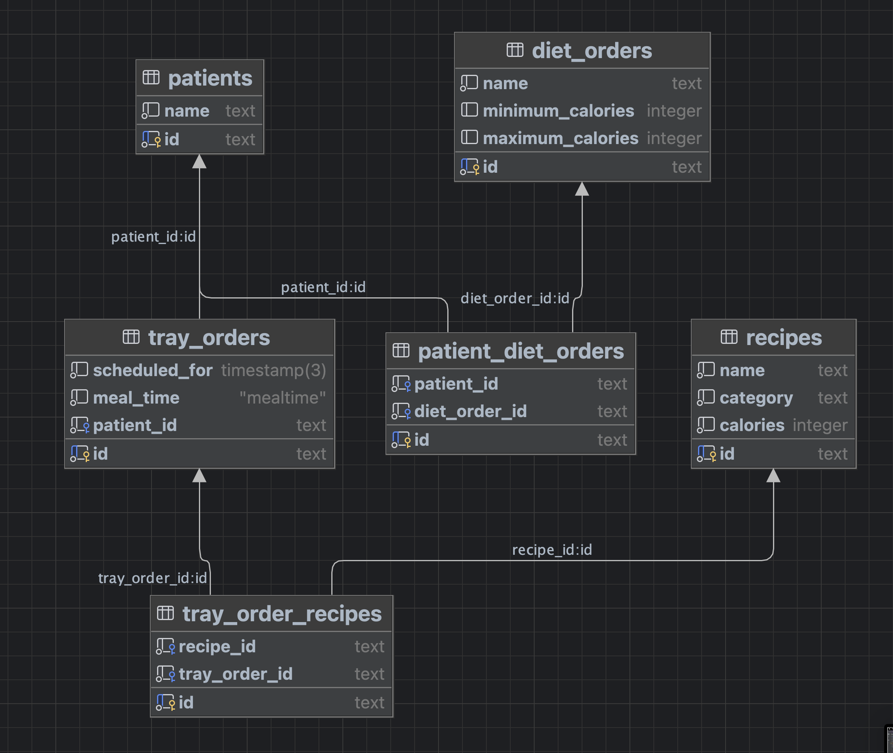
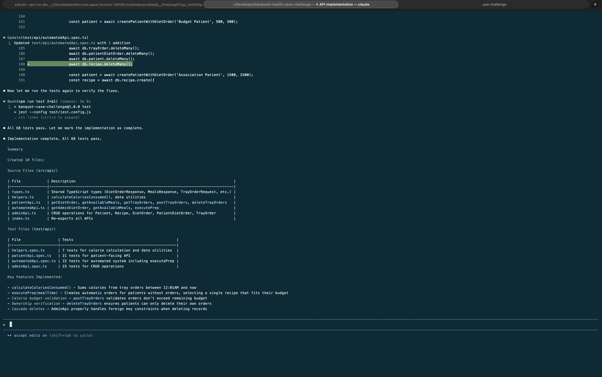
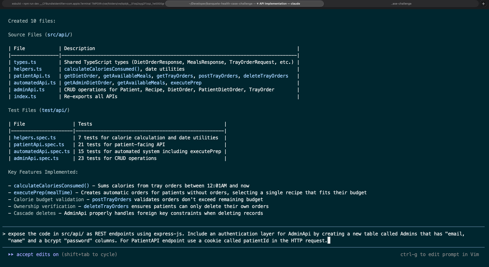
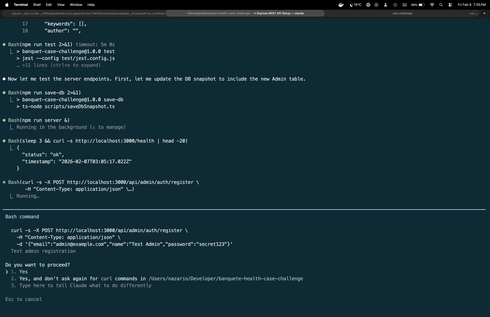
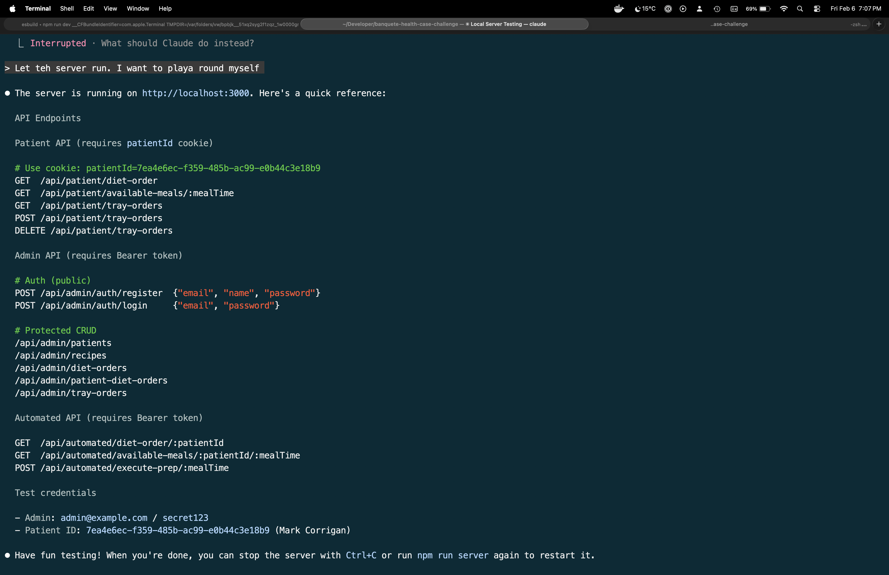

Nazario (niz, naz) thought process
==================================

Kind of stream of conscious.

**product**

Just read the requirements. Sounds similar to another company that was used a lot before the pandemic when people worked in office. The company made or gathered meals for office employees.

A user could set up their meal preferences ahead of time in case they forgot to place an order on time. preferences included allergens, types of protein, cuisine, etc.

**technical**

Looking through the code base it does look like redwoodJS structure.
I have not looked at every file yet but I will initiate a git repo and then run npm install just to get it running and see what I have to work wth.

I see that there is also a docker file that I will explore shortly.

back of my mind is the product stuff I mentioned above. 

---
Just got the database up and running and looking over the schema.

I see that it has data. Looks like the FE is 100% open to me.

I will eat some lunch think about a users workflow MVP and come back to this. I may write stuff down on paper/white board. I will try to document stuff in `systemDesign` directory.

---

Ok I lied I looked at the schema just a bit

"diet_orders" - is like a "menu" of diets that a patient might have. Like for high blood-pressure, cholesterol, etc, etc. I'll ask my wife for realistic values here just make it more realistic.

"patient_diet_orders" - is the actual diet "prescription" for a given patient

"recipies" - holds the individual recipies. These will need to be made available (or not) to the patient so long it fits within the patients "prescription"

I am getting hungry, so I am going to come back to the last 2 tables.

| Calories    | Type   |
|-------------|--------|
| 0 - 1000    | liquid |
| 1001 - 1500 | bland  |
| 1501 - 2000 | normal |

---

I just got back from walking the dogs.

My wife and I chatted about this some more. She was a doctor back in the old country and here she manages nurses.
She has a lot of cool ideas about what and how meals should be made but I am having to focus her on calories (as a stand-in for other dietary restrictions).

This is my quick check in. I am about to decide how I want to proceed in terms of user flow and API. I am going to try to stick to the schema as it is and only make changes if absolutely necessary. Any "extra" changes will be documented along with a reason
but not implemented, most likely for future growth.

Please sit tight

---

Questions regarding edge cases:
- what happens if the patient checks in late in the day and is given lots of calories. Do we allow them to order more than allowed
- what happens if the prescribed calories is decreased mid-day?
- I am going to make it so that the patient_diet_orders are set on initial patient intake and only adjusted once a day. After speaking with my wife, these could be adjustable after every visit by a physician.

---

I am getting into the nitty-gritty of the automated aspect of placing the order. I am not 100% sure why we need "tray_orders" and "tray_order_recipies".

I see the "natural" relationship between "tray_orders" and "recipies" as a OneToMany...
I am kind of whipped I may just look to write up the interface, then pipe this through Claude.

TBH I just want to code...

---

**It is Friday, Feb 6**

So... I just sat down. Today has been swamped with a bunch of stuff and i am just now sitting down.

That does not mean I have not been thinking about the APIs and how this would work. Something I am not 100% sure about is how / if we should limit the user when placing their order or if we should allow them to use up all of their Calories in one go. Or maybe it will be a combination of limiting bot the number of meals and the Calories.

For example, assume 2000 calories is what is prescribed.

The Patient wants to order Breakfast. Should they be able to order 2000 calories worth of food? Should we divide the number of calories by number of meals left in the day?, Do we know that zero meals are than a threshold of calories?

I think I am going to make it so that the user can only order one meal, I will let teh user exhaust their calorie count in one meal (should such a meal exist). And if they later want to order a meal and are over by even a bit they just wont be able to place the order.

---

LOLZ LOLZ -- I thought I had to do a front end backend :)
jejeje. Seems like I just have to do the BE specific to teh automated system.

See comments from earlier in teh day as this the most pertinent part me thinks.

---

I just finish running claude against my BACKEND.md readme.
I also had it write test cases. I don't trust this thing one bit. I will test the test via contra test examples. I will do this when I get home as I am currently getting my car serviced... it has been a day!

---

Just arrived at the house. I am going to review the code...
1. hit the end points - verify that the data goes where expected in the database
2. test the test cases - do contra testing to see if they fail by altering the code being tested in such a way that the test should fail

If I have time...
1. I may even make changes to the schema
2. generate FE code...

---

We had friends over, I am just now able to get my thoughts down. Earlier I noticed that Claude did not generate an actual 
HTTP server with API calls which is not needed for the final submission as you are only asking for the automated portion,
which makes it a bit harder to test the various pathways.

So I followed Claude up with the following prompt 

---

I do not like the file structure.. I may spend a few minutes cleaning this up before I got to bed. I still have not tested the actual code paths.

---

Welp holly smokes. I barely slept last night. I've used Cursor and this is the first time I have used paid Claude and I feel like I am driving a spaceship.

I am having fun thinking of al kinds of things I can do. Specifically I was thinking about the user flow from the perspective of a Patient and Provider.

How the Patient/Provider would auth and setup a new Patient.

This morning I forced myself to read the email and what you are asking for in terms of requirements...

At the end of the day I am look for a job and therefor I need to at least meet your bare minimum and specifically the auto ordering bit.

So I am going to focus on doing the things you are asking for.

---

testing admin end-points:
1. Create admin
2. Login with admin
3. Create Patient
4. Associate Patient with DietOrders (PASS)
